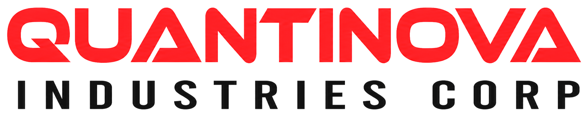

 

  <picture>
    <source media="(prefers-color-scheme: dark)" srcset="assets/QIC_BANNER_DARK.png">
    
  </picture>

  <strong>Industrial supply, engineering support, procurement systems, and operational technology.</strong>

 

QUANTINOVA INDUSTRIES CORP (QIC) builds disciplined systems for sourcing, technical evaluation, project delivery, and accountable operations. The QIC GitHub organization contains the software, automation, documentation, and governance components that support those functions.

## What we work on

- procurement and bid-intelligence workflows;
- supplier and product-data systems;
- internal operations automation;
- engineering calculation and assessment tools;
- secure cloud and application infrastructure;
- reusable corporate standards and documentation.

## Engineering principles

We design and maintain systems around the following controls:

1. **Security by default** — least privilege, protected branches, reviewed changes, and no secrets in source control.
2. **Traceability** — decisions, code changes, approvals, and releases must be auditable.
3. **Maintainability** — clear ownership, documented interfaces, automated tests, and controlled dependencies.
4. **Operational fit** — technology must support actual business processes and accountable human review.
5. **Repository separation** — public, internal, confidential, and restricted information must remain in their approved repositories and access zones.

## Repository standards

Organization repositories should follow the default guidance in this `.github` repository unless a stricter repository-specific policy applies:

- [Contribution guidelines](../CONTRIBUTING.md)
- [Security policy](../SECURITY.md)
- [Support guidance](../SUPPORT.md)
- [Coding standards](../docs/STANDARDS.md)
- [Branch strategy](../docs/BRANCH_STRATEGY.md)
- [Commit conventions](../docs/COMMIT_CONVENTIONS.md)
- [Naming standard](../docs/NAMING_STANDARD.md)
- [Repository baseline](../docs/REPOSITORY_BASELINE.md)

## Security reporting

Do not disclose suspected vulnerabilities in public issues. Use the **Security** tab of the affected repository and select **Report a vulnerability** when private vulnerability reporting is enabled. See the organization [security policy](../SECURITY.md) for the fallback procedure.

## Contributing

Most repositories are maintained for internal corporate use. Where external contributions are accepted, review the repository's `CONTRIBUTING.md`, open an issue before substantial work, and submit changes through a focused pull request.

## Corporate website

[quantinovaindustriescorp.com](https://quantinovaindustriescorp.com)

---

© QUANTINOVA INDUSTRIES CORP. All rights reserved.
